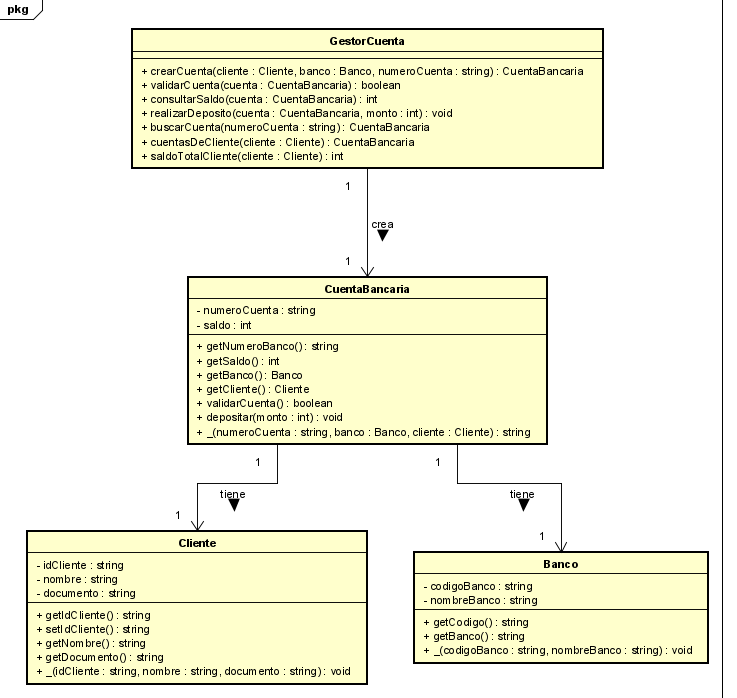

# Laboratorio-3-DOSW

# Reto 1
## Ident
ifiquen reglas de negocio.
- Los números de cuenta deben tener exactamente 10 dígitos.
- Solo es válido si los dos primeros dígitos corresponden a un banco registrado.
- Cada cuenta no debe tener letras ni caracteres especiales.
## Definan las funcionalidades principales.
- Crear cuenta como cliente y validarla.
- Permitir consultas del saldo de una cuenta.
- Hacer un depósito.
## Escriban los actores principales

- Cliente : titular de la cuenta que crea su cuenta, consulta saldo y realiza depósitos.

- Operador de Soporte: administra datos maestros (p. ej., mantenimiento del catálogo de bancos si se gestiona internamente) y atiende casos excepcionales.
## Documenten las precondiciones necesarias para el sistema. 

### Generales (de negocio)

- Formato de número de cuenta válido: exactamente 10 dígitos numéricos, sin letras ni caracteres especiales.

- Banco registrado: los dos primeros dígitos del número de cuenta corresponden a un banco válido en el catálogo.

- Cuenta existente y activa: para consultar saldo o realizar depósitos, la cuenta debe existir en el sistema y estar activa.

- Montos válidos en depósitos: el importe a depositar debe ser numérico y mayor que cero.

- Integridad de datos del cliente: la información mínima del cliente (p. ej., identificación) está registrada y validada antes de crear la cuenta.

### Específicas por funcionalidad

#### Crear cuenta:

- Se verificó el formato del número (10 dígitos) y el código de banco en el catálogo.

#### Consultar saldo:

- La cuenta existe y pasó las validaciones de formato.

#### Realizar depósito:

- La cuenta existe; el monto es positivo y procesable.

# RETO 2
## Realicen un diagrama de contexto de la solución (relaciones entre el sistema y los actores identificados) y explíquenlo.

## Realicen un diagrama de Casos de uso en base a sus actores y las funcionalidades identificadas.

## En base al diagrama anterior generen historias de usuario basado en el formato: Como [actor], quiero [objetivo], para [beneficio]
- COMO usuario QUIERO crear una cuenta PARA PODER depositar mi dinero.
- COMO usuario QUIERO consultar mi cuenta PARA PODER revisar la cantidad de dinero que poseo
- COMO usuario QUIERO realizar un depósito PARA PODER guardar mi dinero en mi cuenta.
- COMO operador de soporte QUIERO actualizar catálogo de bancos PARA PODER tener más bancos asociados con el sistema.
## Generen una tabla de Excel con las historias de usuario creadas e indique para cada una que atributo de calidad resuelve.

## Realicen un diagrama de Clases de las entidades identificadas en el enunciado. 

# RETO 3

Este proyecto es una simulación de una sesión de Planning Poker en donde un equipo de desarrolladores discuten el nivel de dificultad de una tarea. Todas las partes tienen que estar de acuerdo con el puntaje de la tarea o sino se repetirá hasta llegar a un consenso.

- El puntaje válido es 1, 2, 3, 5, 8 o 13.
- Si la tarea recibe el mismo puntaje, se asigna ese puntaje.
- Si los integrantes del equipo asignan diferentes puntajes a una tarea, entonces se repetirá la votación.
- Al finalizar, se muestra un resumen que muestra el nombre de la tarea y su respetivo puntaje.
- 
### Implementación del código

### ¿Cómo funciona?
- El contructor recibe como parámetros el número de tareas y el número de integrantes del equipo. Después el programa pregunta por el nombre de la tarea. 
Luego se le pedirá a cada integrante que vote por la tarea. El código revisa que todo esté en orden, es decir, que el puntaje cumpla con los requisitos y
 que una tarea haya recibido el mismo puntaje. Por último imprime el nombre de la tarea junto a su puntaje.
### Simulación
- A continuación se simulará el caso en que hay 3 integrantes y dos tareas.

## Principios y Patrones Utilizados
- SRP: Cada método cumple un rol específico (votacion, verificarPuntaje, isVotoCorrecto).
- Validación de entradas: Se asegura que los votos siempre sean parte de la secuencia de Fibonacci antes de aceptarlos.
- Uso de Colecciones Java: HashMap para almacenar tareas y su puntaje final, ArrayList para gestionar votos de los integrantes y Set para valores válidos permitidos.
- DRY: La validación de votos está centralizada en isVotoCorrecto, evitando duplicar lógica.

# RETO 4
# RETO 5
