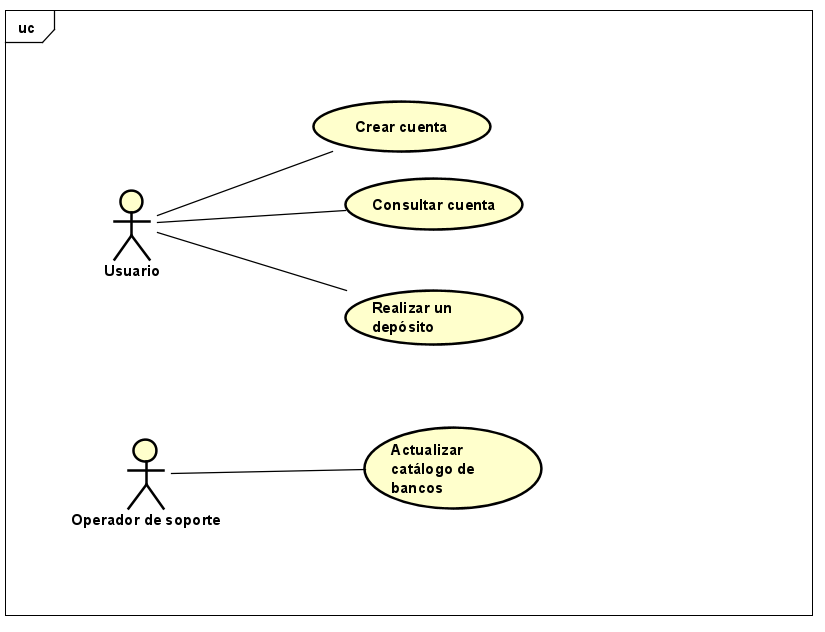

# Reto 2
## Realicen un diagrama de contexto de la solución (relaciones entre el sistema y los actores identificados) y explíquenlo.

## Realicen un diagrama de Casos de uso en base a sus actores y las funcionalidades identificadas.

## En base al diagrama anterior generen historias de usuario basado en el formato: Como [actor], quiero [objetivo], para [beneficio]
- COMO usuario QUIERO crear una cuenta PARA PODER depositar mi dinero.
- COMO usuario QUIERO consultar mi cuenta PARA PODER revisar la cantidad de dinero que poseo
- COMO usuario QUIERO realizar un depósito PARA PODER guardar mi dinero en mi cuenta.
- COMO operador de soporte QUIERO actualizar catálogo de bancos PARA PODER tener más bancos asociados con el sistema.
## Generen una tabla de Excel con las historias de usuario creadas e indique para cada una que atributo de calidad resuelve.

## Realicen un diagrama de Clases de las entidades identificadas en el enunciado. 
